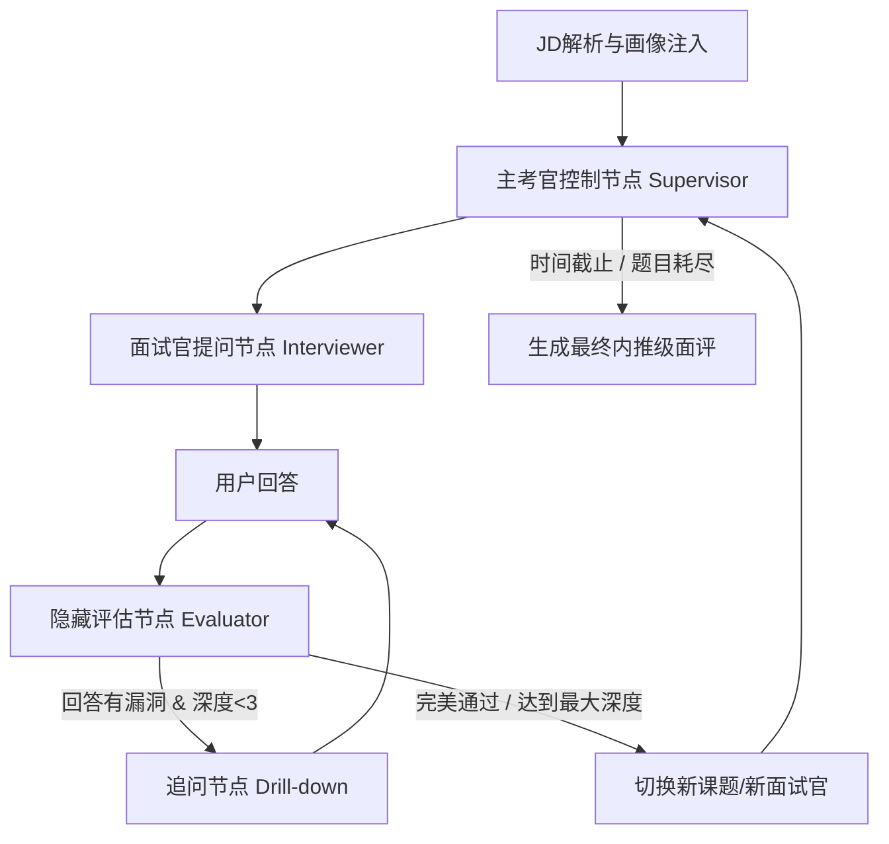

# 赛博面试官（Cyber Interviewer）产品方案与技术架构

> 本文档是项目的"作战地图"——沉淀产品定位、核心机制、技术架构、MVP 边界。
> 后续所有的代码、prompt、UI 都应该回到这份文档来对齐方向。

---

## 一、产品定位

### 1.1 一句话定位

> **基于真实 JD 解构 + Agent 拟人追问的高压模拟面试平台。**
> 让普通求职者，能在家被"顶级大厂面试官"以 1:1 的强度拷打。

### 1.2 两条产品路线（必须选一条作为主干）

| 维度       | 路线 A：JD 拟真模拟器             | 路线 B：大咖镜像 / 认知对齐               |
| ---------- | --------------------------------- | ----------------------------------------- |
| 卖点       | "把 Boss 上那个岗位的面试 1:1 还原" | "让 Sam Altman / 顶级 CTO 来拷打你"      |
| 用户心智   | 练手、查漏补缺、岗前突击          | 认知升级、对标顶尖、心智冲击              |
| 核心壁垒   | JD 解构准确度 + 知识库覆盖度      | 人格蒸馏的"神似度" + 评价体系稀缺性       |
| Agent 哲学 | 要"准"——围绕 JD 技能树提问       | 要"狠"——可脱离 JD，问哲学层面认知        |
| 对标       | 牛客网模拟面试的 AI 升级版        | 得到 + 模拟面试，"心智奢侈品"             |
| 验证难度   | 中等，机制可跑通就成立            | 高，"神似度"难量化、难验证                |

### 1.3 当前决策：A 是内核，B 是二面的人格皮肤

**A 和 B 不冲突，而是分工互补**——它们对应真实面试中的不同轮次：

```
一面（技术初面）  ← A 路线主导：JD 拟真，追求"准"
                   面试官 = 该岗位真实的技术 Lead 画像
                   考察：基础、落地、细节、JD 技能树覆盖度

二面（压力终面）  ← B 路线主导：大咖镜像，追求"狠"
                   面试官 = Sam Altman / Dario / 顶级 CTO 人格皮肤
                   考察：认知、视野、Scaling Law 哲学、工程与商业权衡
```

**为什么这样分工是合理的**：
- 一面如果就上"大咖人格"，用户会觉得跑题、和岗位无关
- 二面如果还是 JD 技能树细抠，就少了"心智冲击"和差异化卖点
- 真实大厂面试本来就是这个结构——初面问细节，终面问认知，完美贴合

**实施节奏**：
- **MVP 阶段先走 A 内核**（JD → 技能树 → 追问闭环），把拟真机制跑通
- **B 路线作为后续可叠加的"人格皮肤"层**——换一套 system prompt + RAG 语料即可切换
- 皮肤层与内核解耦：人格只影响"问什么、怎么问"，不影响状态机逻辑

**好处**：
- 今晚就能见到东西（A 路线机制清晰、可验证）
- 长期不堵死 B 路线（皮肤层即插即用，二面直接套上）
- 商业上"工具属性"先立住，再叠加"心智属性"

---

## 二、产品的"灵魂"：拟真感从哪来

我们和市面上通用 AI 面试官的本质区别，**不在于问什么，而在于怎么问、怎么评**。
以下四个机制是拟真感的来源，缺一不可：

### 2.1 业务情境化提问（反八股文）

不问 "什么是 Transformer"，而是问：
> "现在我们要在一个单卡 A10（24G 显存）上部署 70B Llama 3，要求推理延迟 < 100ms，
> 你会选什么量化方案？如果还是溢出，从算子融合还是 KV Cache 入手？"

### 2.2 动态追问（Drill-down Loop）

用户每次回答后，**隐藏 Evaluator** 先判断含金量：
- 流于表面 → 追问深一层（最多 3 层）
- 触及核心 → 换新课题
- 有明显漏洞 → 针对漏洞追问

这是消除"一问一答八股文感"的核心机制。

### 2.3 隐藏小本子（Red Flags 累积）

面试官在心里持续打分，不是结束后才回想：

```
hidden_scratchpad = {
    "technical_skills_score": { "分布式训练": 75, "内核通信": 40 },
    "soft_skills": { "抗压能力": "优", "表达清晰度": "中" },
    "red_flags": ["对底层原理了解不够深入，倾向于使用高层 API"]
}
```

后续轮次/问题会**针对 red_flags 主动挖坑**，实现千人千面。

### 2.4 节奏控制与强制打断

如果用户连续输入长篇大论（背八股文），系统触发 `is_interrupted`：
> "好的，由于时间关系，理论我们先聊到这。直接看你在这个项目里负责的架构优化部分，
> 在这个 QPS 下你是怎么做的？"

---

## 三、技术架构

### 3.1 技术栈选型

| 层级           | 选型                                                                   |
| -------------- | ---------------------------------------------------------------------- |
| 后端 Agent     | **LangChain + LangGraph**（核心，负责状态机与多 Agent 路由）           |
| LLM            | Evaluator 用强模型（GPT-4o / Claude Opus），Interviewer 可用稍弱模型   |
| 向量库         | Milvus / Pinecone（MVP 阶段先不上，知识写死在 prompt）                 |
| 前端（远期）   | 微信小程序 / Uni-app + Bento Grid 深色极客风                           |
| JD 数据源      | MVP 阶段手工粘贴；远期再考虑爬取（合规性需评估）                       |

### 3.2 Agent 状态机（LangGraph DAG）



### 3.3 全局状态数据结构

```python
from typing import TypedDict, List, Dict, Any

class InterviewState(TypedDict):
    chat_history: List[Dict[str, str]]       # 显式对话历史（前端可见）
    current_topic: str                        # 当前考察的技术点
    current_depth: int                        # 当前技术点追问深度（0-3）
    hidden_scratchpad: Dict[str, Any]         # 隐藏小本子（前端不可见）
    red_flags: List[str]                      # 候选人技术薄弱点
    is_interrupted: bool                      # 是否触发强制打断
    skill_tree: Dict[str, Any]                # JD 解构出的技能树
    topics_covered: List[str]                 # 已覆盖过的技术点
```

### 3.4 核心节点职责

| 节点             | 职责                                                                  | 是否对用户可见 |
| ---------------- | --------------------------------------------------------------------- | -------------- |
| **JD Parser**    | 把 JD 文本解构为三级技能树（领域→技术点→子技术点）                    | 否             |
| **Supervisor**   | 主控路由，决定走哪一轮、读取 red_flags 注入到下游 prompt              | 否             |
| **Interviewer**  | 生成"业务情境化"提问，扮演特定人格                                    | 是             |
| **Evaluator**    | 隐藏评估用户回答，输出 JSON：是否有漏洞、含金量、red_flags 更新       | **否**（核心） |
| **Drill-down**   | 根据 Evaluator 的漏洞描述，生成连环追问                              | 是             |
| **Topic Switch** | 从技能树中选下一个未覆盖的技术点                                      | 是             |
| **Reporter**     | 最终生成"内推级"面评报告，含定级、刻薄点评、改进建议                  | 是             |

### 3.5 Evaluator 的 JSON 输出规范（关键）

Evaluator 是拟真的灵魂，它的输出必须严格结构化：

```json
{
  "score": 65,
  "is_satisfied": false,
  "answer_quality": "surface | core | deep",
  "found_gaps": [
    "未考虑分布式训练中的通信瓶颈",
    "对 KV Cache 内存占用估算有误"
  ],
  "should_drill_down": true,
  "drill_down_hint": "追问通信开销在带宽受限场景下的影响",
  "red_flags_to_add": ["缺乏分布式系统实操经验"],
  "topic_finished": false
}
```

### 3.6 人格矩阵(Persona Matrix)Prompt 拼接设计

**目标**:让面试官的"性格"既可被用户预设(卡片),又可被精细调节(滑块),且对后端 Prompt 工程友好。

#### 3.6.1 用户视角

用户在准备页:
1. 选择 4 张预设人格卡片之一(或"随机")
2. 选完后下方出现 4 个滑块(已带卡片默认值),可微调

#### 3.6.2 后端 Prompt 拼接公式

```
最终 system_prompt = BASE_PROMPT
                   + PERSONA_CARD_BLOCK(注入卡片描述)
                   + PERSONA_DIMENSION_BLOCK(注入滑块参数和行为约束)
                   + MODE_PROMPT(OPENING / DRILL_DOWN / SWITCH_TOPIC)
```

四块依次拼接,**前面定基调,后面定动作**。

#### 3.6.3 4 张人格卡片定义(MVP 版)

| 卡片 ID | 名称 | 描述(注入到 Prompt) | 默认滑块(温/深/节/视) |
|---|---|---|---|
| `cold_techlead` | 冷酷大厂 Tech Lead | "你是前 Google 风格的资深架构师。不寒暄、不鼓励,任何空话都要追问具体场景和数字。看不起空谈,只信落地。" | 20 / 80 / 70 / 40 |
| `vision_master` | OpenAI 视野流大咖 | "你是 Sam Altman / Dario 风格的行业领袖。你关心候选人对 Scaling Law、工程与商业权衡、AI 长期影响的思考。你不抠技术细节,但会让候选人在认知层面无处可逃。" | 50 / 50 / 40 / 95 |
| `product_mentor` | 资深产品 Mentor | "你是 10 年+ 资深 PM 出身的面试官。友好引导,关心方法论,看候选人潜力。会肯定亮点,但对方法论漏洞绝不放过。" | 80 / 60 / 30 / 60 |
| `researcher` | 直接的研究员 | "你是 DeepSeek/Anthropic 风格的研究员。直奔技术原理,不耐烦表面话术,听到模糊词汇会立刻打断。" | 40 / 90 / 60 / 50 |

#### 3.6.4 4 个滑块语义与 Prompt 注入

每个滑块 0-100,**根据数值分档,注入对应的行为约束语**:

| 滑块 | 维度名 | 0 端(0-33) | 中段(34-66) | 100 端(67-100) |
|---|---|---|---|---|
| **温和度** | warmth | "你的语气冷峻,从不寒暄。" | "你的语气中性专业。" | "你的语气温和,会给候选人鼓励。" |
| **深度偏好** | depth_preference | "你偏好概念层、视野层的问题。" | "你平衡考察概念与实操。" | "你只关心实操,任何概念回答必须追问 hands-on 经验。" |
| **节奏** | pace | "你给候选人充分思考时间。" | "你的节奏中等,适度追问。" | "你节奏紧凑,追问密集,候选人话多即打断。" |
| **视野** | vision | "你抠技术细节,不关心宏观。" | "你既问细节也问视野。" | "你关心战略和行业格局,会问'5 年后这个技术怎么演进'。" |

**实现示例**(Python 伪代码):

```python
def build_persona_block(card_id: str, dims: dict) -> str:
    card = PERSONA_CARDS[card_id]
    warmth_band = bucket(dims['warmth'])           # 'low'|'mid'|'high'
    depth_band = bucket(dims['depth_preference'])
    pace_band = bucket(dims['pace'])
    vision_band = bucket(dims['vision'])

    return f"""
[人格基底]
{card['description']}

[人格调节]
- 温度: {WARMTH_TEXTS[warmth_band]}
- 深度偏好: {DEPTH_TEXTS[depth_band]}
- 节奏: {PACE_TEXTS[pace_band]}
- 视野: {VISION_TEXTS[vision_band]}

[当前面试官状态对外可见标识]
你的"心情"应该和上述基调一致。当满意度高时表现"身体前倾",
低时表现"皱眉"。
"""
```

#### 3.6.5 影响范围

- **Interviewer 子图**:必须按人格调整提问语气、追问风格、是否打断
- **Evaluator 子图**:**不受人格影响**,评估永远客观公正
  - 否则会出现"友好人格给高分"的偏差,破坏拟真感
- **Next Topic Generator**:轻度受人格影响(视野高的人格倾向选高 weight 题)
- **拟人状态(interviewer_state)推送**:状态文字可随人格调整,如"冷酷"人格用"冷哼一声"代替"皱眉"(MVP 阶段先用统一状态库,后续做人格专属皮肤)

#### 3.6.6 前后端数据契约

API 字段(详见 [接口规范.md](mvp/docs/接口规范.md) §2.3):

```json
{
  "persona": {
    "card_id": "cold_techlead",
    "dimensions": {
      "warmth": 20,
      "depth_preference": 85,
      "pace": 75,
      "vision": 45
    }
  }
}
```

后端在 `POST /api/sessions/:id/start` 收到后,立即把这套配置写入 session,后续所有 Interviewer 调用都用拼接后的 system_prompt。

---

## 四、MVP 边界（今晚的目标）

### 4.1 今晚要跑通的最小闭环

```
[手工准备1份JD]
    ↓
[LLM 解析为简化版技能树（写死 prompt）]
    ↓
[Interviewer 生成开场问题]
    ↓
[用户在命令行回答]
    ↓
[Evaluator 隐藏评估，输出 JSON]
    ↓
[Router 判断：追问 or 换题]
    ↓
[循环 N 次后退出]
```

### 4.2 砍掉的事（明确不做）

- ❌ 不爬 Boss 直聘（合规风险 + 调爬虫耗时间）→ 手工粘贴 1-2 份 JD
- ❌ 不做车轮战多 Agent 路由 → 只跑单个面试官
- ❌ 不做向量库 RAG → 知识写死在 prompt 里
- ❌ 不做前端 → 命令行交互
- ❌ 不做最终面评报告 → 能追问 3 层就算成功
- ❌ 不做语音交互 → 纯文字

### 4.3 MVP 的成功标准

跑完后能拿出这样一段对话证明机制成立：

1. Interviewer 基于 JD 提了一个**业务情境化**问题（不是八股文）
2. 用户故意答得很浅
3. Evaluator **正确识别**回答流于表面
4. Drill-down **针对具体漏洞**追问，而不是泛泛地说"能详细说说吗"
5. 经过 2-3 轮追问，用户答到核心后，**换到新课题**
6. 全程 Evaluator 的判断在终端打印出来（debug 模式）能看到逻辑链

---

## 五、远期推进路线

### 阶段一：MVP 内核验证（本周）
- [x] 产品定位与架构对齐
- [ ] LangGraph 最小闭环跑通
- [ ] Evaluator prompt 反复调优至判断稳定

### 阶段二：单轮面试完整版（2-3 周）
- [ ] 完善 JD Parser，能从真实 JD 文本解构技能树
- [ ] 加入"小本子"机制，红牌能跨问题累积
- [ ] 加入打断机制
- [ ] 生成第一版面评报告

### 阶段三：车轮战 + 大咖镜像（1-2 月）
- [ ] 多 Agent Supervisor 路由：**一面（JD 拟真）→ 二面（大咖镜像压力面）**
- [ ] 接入 RAG 向量库（AI Infra 论文 + 大厂面经 + 大咖博客/演讲语料）
- [ ] 二面落地第一个"大咖镜像"人格皮肤（候选：Sam Altman / Dario / 国内顶级 CTO）
- [ ] 一面→二面之间的"小本子"传递机制（二面读取一面 red_flags 重点挖坑）

### 阶段四：前端 + 商业化（2-3 月）
- [ ] 微信小程序前端（Bento Grid 视觉）
- [ ] JD 数据源合规方案
- [ ] 用户增长与转化路径

---

## 六、待决策的关键问题

1. **LLM 选型**：Evaluator 和 Interviewer 分别用什么模型？API key 准备好了吗？
2. **JD 数据**：MVP 阶段先用哪 1-2 份 JD 做种子？建议聚焦 AI Infra / 算法岗。
3. **技能树粒度**：三级是否够？怎么定义"一个技术点已经考完"？
4. **红牌阈值**：多少分以下算红牌？连续几次浅答触发"重点挖坑"？
5. **远期 B 路线**：第一个要做的"大咖镜像"选谁？（Sam Altman / Dario / 国内大佬？）

---

## 附录：核心 Prompt 草稿位（待填）

### A. Evaluator Prompt（最重要）
> 待今晚跑通后填入实际版本

### B. Interviewer Prompt
> 待今晚跑通后填入实际版本

### C. Drill-down Prompt
> 待今晚跑通后填入实际版本
